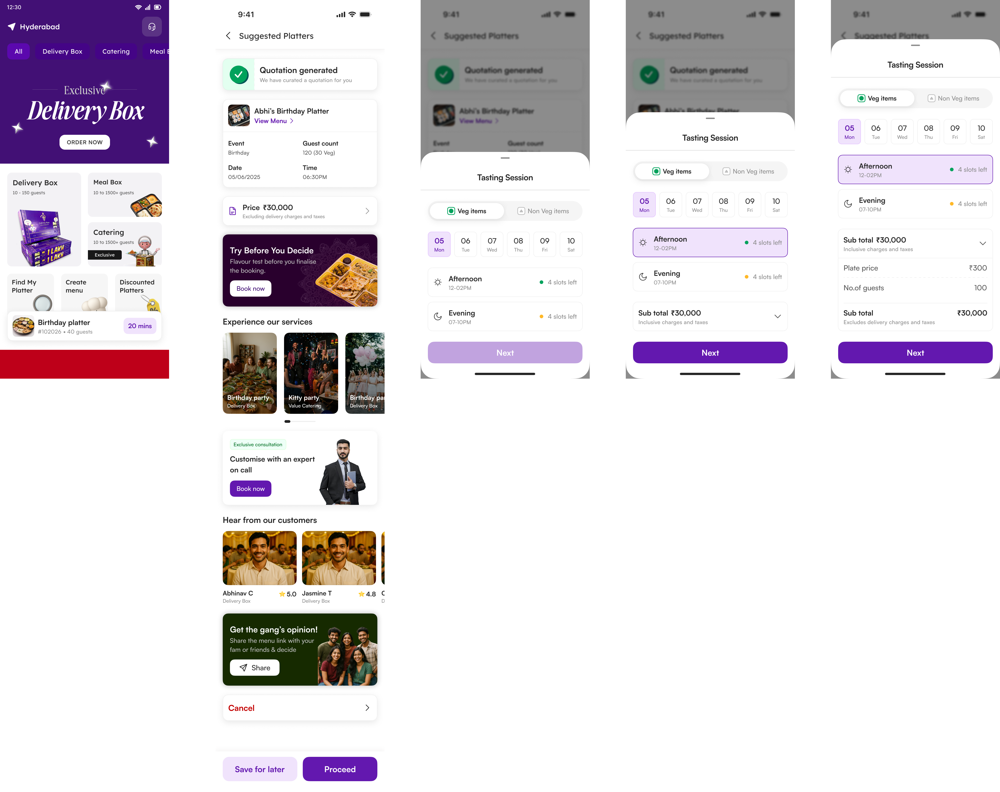

# CMP Assignment – Internship Assessment for Craft My Plate

Successfully completed a coding assignment provided by **Craft My Plate**, Hyderabad, as part of their internship assessment process.

## 📋 Task Overview
The objective was to replicate Figma design prototypes using **Flutter**, ensuring:
- Fully responsive layouts across a wide range of device screen sizes
- Clean, maintainable UI code following best practices

## 🎨 Provided Design
Figma design reference:  

## 🎬 Final Prototype

**Design to Code – Prototype Video:**  

**Flutter Implementation Demo:**  

## 🛠️ Key Highlights
- Developed using **Flutter**
- Used **Provider** for efficient state management
- Ensured **data and state integrity** across screens
- Focused on **pixel-perfect UI** and full **responsiveness** for various screen sizes

---
